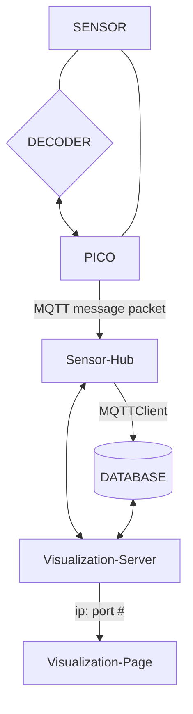

```mermaid
graph TD
A[SENSOR] --- B{DECODER}
B <--> C[PICO]
A --- C


Sensor-Hub
C --> |MQTT message packet| Sensor-Hub

Sensor-Hub --> |MQTTClient| DATABASE[(DATABASE)]

Sensor-Hub <--> Visualization-Server

DATABASE <--> Visualization-Server --> |ip: port #| Visualization-Page
```

